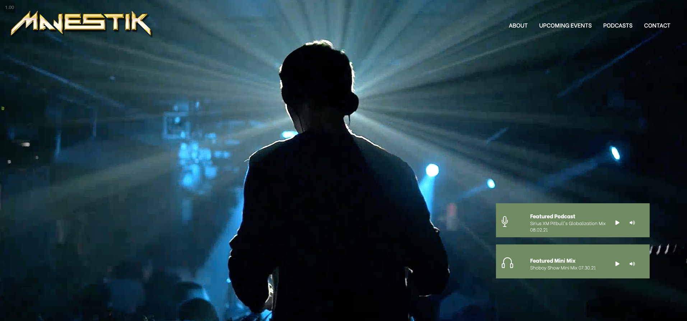
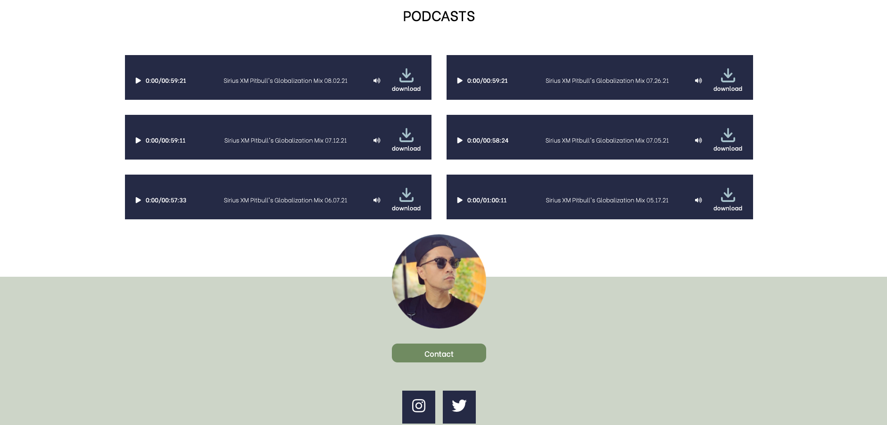

# DJ Majestik Profile Website

Responsive website for DJ/Radio Personality, featuring responsive background video, custom podcasts and upcoming events displayed in animated cards.

Live demo [_here_](https://dj-majestik.netlify.app/)

> prototype version

## Technologies Used

- Vanilla JS

## Hosted on

- Netlify

## Features

- Autoplay video background on landing page
- Custom audio players of DJ's podcast or mixes
- Animated cards that flip for details
- contact link to gmail

## Landing Page

## Custom video players

## Contact

Created by [@cfrancisco726](http://www.carlofrancisco.com) - feel free to contact me!
